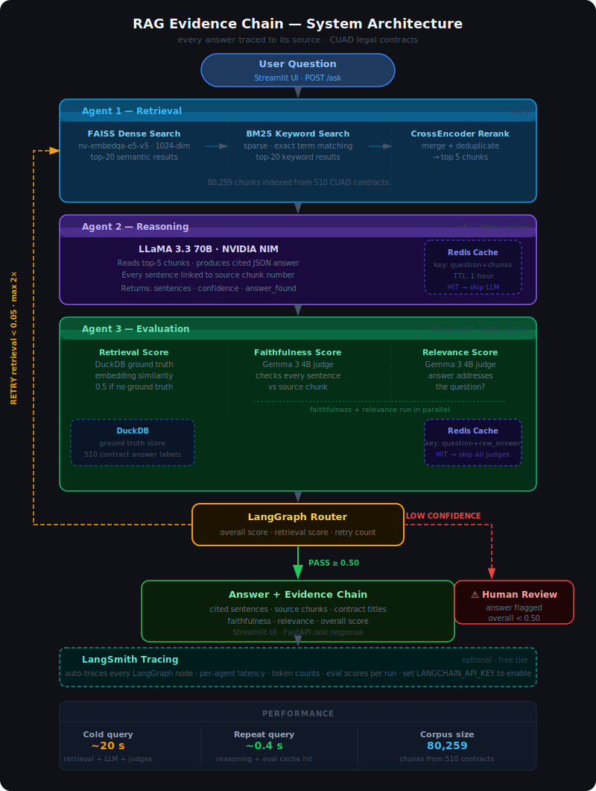

# RAG Evidence Chain

> Agentic RAG system for legal contract Q&A — every answer is traced sentence-by-sentence back to its source chunk.


---

## What it does

Ask any question about a legal contract and get:

- A precise answer grounded in the contract text
- Every sentence linked to the exact chunk it came from
- Three independent quality scores (retrieval, faithfulness, relevance)
- Automatic retry when retrieval quality is low
- Human review flagging when the system is uncertain

Built on the [CUAD dataset](https://huggingface.co/datasets/cuad) — 510 commercial contracts with expert-annotated clause labels.

---

## Architecture



Two separate model families are used deliberately — LLaMA 3.3 70B generates the answer, Gemma 3 4B evaluates it. Different architectures and pre-training data prevent the judge from self-grading bias.

---

## Stack

| Layer | Technology |
|---|---|
| LLMs | NVIDIA NIM — LLaMA 3.3 70B (reasoning), Gemma 3 4B (judge) |
| Embeddings | NVIDIA nv-embedqa-e5-v5 (1024-dim) |
| Retrieval | FAISS + BM25 + CrossEncoder reranker |
| Orchestration | LangGraph (stateful graph with conditional routing) |
| Cache | Redis (reasoning + evaluation results, 1hr TTL, circuit breaker) |
| Database | DuckDB (contracts, ground truth, evaluation history) |
| Backend | FastAPI + SlowAPI rate limiting + API key auth |
| Frontend | Streamlit + Plotly (evidence chain graph) |
| Observability | LangSmith tracing, Weights & Biases |
| Deployment | Docker, HuggingFace Spaces |

---

## Quick Start

### Prerequisites

- Python 3.11+
- A free [NVIDIA NIM API key](https://build.nvidia.com)
- Redis running locally (optional — caching is skipped gracefully if unavailable)

### 1. Clone and install

```bash
git clone https://github.com/swethasays/rag-evidence-chain.git
cd rag-evidence-chain
pip install -r requirements.txt
```

### 2. Configure environment

```bash
cp .env.example .env
```

Open `.env` and set at minimum:

```
NVIDIA_API_KEY=your_key_here
```

### 3. Ingest the data

Downloads the CUAD dataset, chunks contracts, embeds ~80k vectors via NVIDIA API, and stores them in FAISS + DuckDB. Takes 10–15 minutes on first run.

```bash
python data/ingest.py
```

### 4. Run

```bash
# API (port 8000) + UI (port 7860) together:
./start.sh

# Or separately:
uvicorn api.main:app --port 8000
streamlit run ui/app.py
```

Open `http://localhost:7860` in your browser.

### Docker

```bash
docker build -t rag-evidence-chain .
docker run -p 7860:7860 -p 8000:8000 --env-file .env rag-evidence-chain
```

---

## Environment Variables

| Variable | Required | Description |
|---|---|---|
| `NVIDIA_API_KEY` | Yes | NVIDIA NIM API key for LLMs and embeddings |
| `API_KEY` | No | Enables API key auth — set this in production |
| `REDIS_URL` | No | Redis connection string (default: `redis://localhost:6379`) |
| `LANGCHAIN_API_KEY` | No | LangSmith tracing |
| `WANDB_API_KEY` | No | Weights & Biases experiment tracking |
| `PINECONE_API_KEY` | No | Required only if `VECTOR_STORE_TYPE=pinecone` |
| `GCP_BUCKET_NAME` | No | Required only if `STORAGE_TYPE=gcp` |
| `AWS_BUCKET_NAME` | No | Required only if `STORAGE_TYPE=s3` |

---

## API

The FastAPI backend is available at `http://localhost:8000`. Interactive docs at `/docs`.

**POST /ask**
```bash
curl -X POST http://localhost:8000/ask \
  -H "Content-Type: application/json" \
  -d '{"question": "What are the termination conditions?"}'
```

Response includes `answer`, `sentences` (each with `chunk_id`, `contract_title`, `confidence`), `eval_scores`, and `needs_human_review`.

When `API_KEY` is set in the environment, all requests must include the header:
```
X-API-Key: your_key_here
```

---

## Performance

| Query | Latency |
|---|---|
| First query (cold) | ~20s |
| Repeat query (cache hit) | ~0.4s |

First queries are slow by design — each one makes three remote API calls: an embedding model, LLaMA 3.3 70B for reasoning (~9s), and Gemma 3 4B for evaluation. That's the cost of the pipeline, not a bug.

**Optimisations already applied:**
- Faithfulness and relevance judge calls run in parallel (ThreadPoolExecutor)
- Faithfulness prompt reduced from ~780 tokens to ~250 tokens
- Redis caches both reasoning and evaluation results — identical repeat queries skip all LLM calls

**What would help in a real deployment:** streaming responses (send tokens as they generate), async evaluation (return answer immediately, show scores when ready), and model routing (use LLaMA 8B for simpler questions).

---

## Tests

```bash
pytest tests/
```

Five test modules — one per agent plus API and graph routing. Tests run without models, database, or API keys (agents are mocked).

---

## Project Structure

```
rag-evidence-chain/
├── agents/
│   ├── retrieval.py      # Agent 1 — FAISS + BM25 + CrossEncoder
│   ├── reasoning.py      # Agent 2 — LLM answer + cited sentences
│   ├── evaluation.py     # Agent 3 — three-score quality judge
│   └── graph.py          # LangGraph pipeline + routing logic
├── api/
│   ├── main.py           # FastAPI endpoints
│   ├── models.py         # Pydantic request/response models
│   └── middleware.py     # CORS + rate limiting
├── data/
│   ├── ingest.py         # CUAD ingestion pipeline
│   ├── chunker.py        # semantic chunking
│   ├── storage/          # local / GCP / S3 abstraction
│   └── vectorstore/      # FAISS / Pinecone abstraction
├── observability/
│   ├── tracing.py        # LangSmith
│   └── logging.py        # structured logging
├── ui/
│   └── app.py            # Streamlit frontend + evidence graph
├── tests/                # mocked unit tests for all agents
├── config.py             # all config in one place
├── Dockerfile
├── start.sh              # starts API + UI together
└── requirements.txt
```

---

## Production Gaps

This project demonstrates production architecture patterns but is not a production deployment. What would be needed before serving real users:

| Gap | Current | Production swap |
|---|---|---|
| Vector store | FAISS (in-memory, single node) | Pinecone or Weaviate |
| Database | DuckDB (local file) | PostgreSQL |
| Authentication | Single shared API key | Per-user keys or OAuth 2.0 / JWT |
| File storage | Local disk | S3 or GCP Cloud Storage |
| Scaling | Single process | Kubernetes or Cloud Run |
| Secrets | `.env` file | AWS Secrets Manager or GCP Secret Manager |

The config stubs for Pinecone, S3, and GCP are already in `config.py` — each swap is a one-line change.

---

## Learnings

A detailed write-up of the real problems hit, decisions made, and what each one taught me — from latency debugging to silent cache failures to why two model families are used deliberately.

→ [LEARNINGS.md](LEARNINGS.md)
